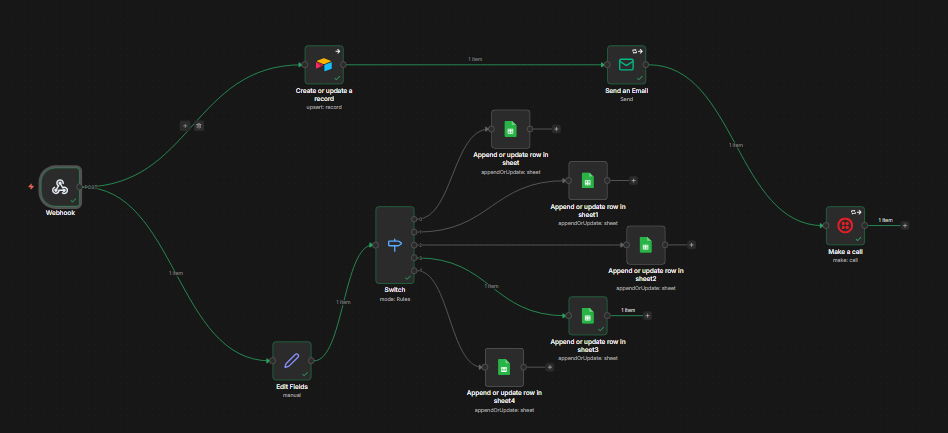

# AI-Powered Course Enrollment Automation System

- An intelligent automation workflow built using n8n to manage student registration, communication, and failure recovery for educational institutes.

- This system eliminates manual enrollment handling and replaces it with a multi-channel, AI-assisted automation pipeline.

## Basic Flow of Automation

Trigger
   ↓
Input Processing
   ↓
Decision
   ↓
Action

## 📌 Problem Statement

Educational institutes often rely on manual processes to:
- Record student registrations
- Send confirmation emails
- Handle communication failures
- Maintain student databases

These processes are:
- Time-consuming
- Error-prone
- Operationally inefficient
- Lacking intelligent recovery mechanisms

## 🎯 Solution Overview

This system automates the complete enrollment lifecycle:
- Student registers via institute portal
- Data is validated and stored
- Confirmation email is sent
- If email fails → AI agent decides fallback action
- SMS or Phone Call is triggered automatically
- Admin is notified if critical failure occurs

## 🧠 Intelligent Failure Recovery

The AI agent analyzes delivery status and decides:
- Retry email
- Send SMS fallback
- Initiate automated phone call
- Trigger admin alert
- This ensures no student registration is lost due to communication failure.

## 🚀 Core Features

- Webhook-based registration intake
- Data validation layer
- Google Sheets course-wise storage
- Airtable master database storage
- Automated email confirmation
- Twilio SMS fallback
- Twilio phone call fallback
- AI-powered recovery decision engine
- Admin notification system
- Centralized workflow architecture

## 🏗 Workflow Architecture

Webhook
   ↓
Database Storage (Google Sheets + Airtable)
   ↓
Email Confirmation
   ↓
Delivery Check
   ↓
SMS / Phone Fallback
   ↓
Admin Alert (if required)

### Workflow Image

## 🛠 Tech Stack

- n8n – Workflow orchestration
- OpenAI API – Decision intelligence
- Google Sheets – Course-wise database
- Airtable – Central student registry
- Twilio – SMS & Voice calls
- Gmail / SMTP – Email service
- Git & GitHub – Version control

## ⚙ Setup Instructions

- Clone the repository
- git clone <repository-url>
- Configure environment variables:
- OpenAI API Key
- Twilio Account SID
- Twilio Auth Token
- Google Sheets credentials
- Airtable credentials
- Email service credentials
- Import workflow JSON into n8n
- Activate workflow

## 📈 Future Enhancements

- Payment gateway integration
- AI chatbot for admission queries
- Automated certificate generation
- Enrollment analytics dashboard
- Batch capacity intelligence engine
- Fraud detection (fake email detection layer)

## 💼 Business Impact

- Reduces manual administrative workload
- Ensures reliable multi-channel communication
- Prevents data loss from email failures
- Improves operational efficiency
- Scales enrollment handling without additional manpower